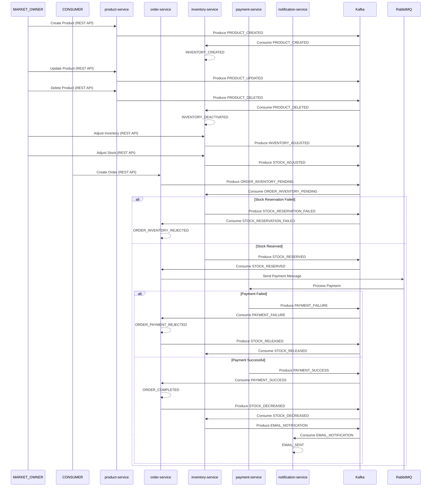

# Microservices

Microservices Architecture: General Concepts and Implementations in the Spring Ecosystem

1. [General Concepts & Technologies](documents/GENERAL_CONCEPTS_AND_TECHNOLOGIES.md)
2. [Local Development](documents/LOCAL_DEVELOPMENT.md)
3. [Services and Their External Ports](documents/SERVICES.md)
4. [Technical Flows](documents/FLOWS.md)

