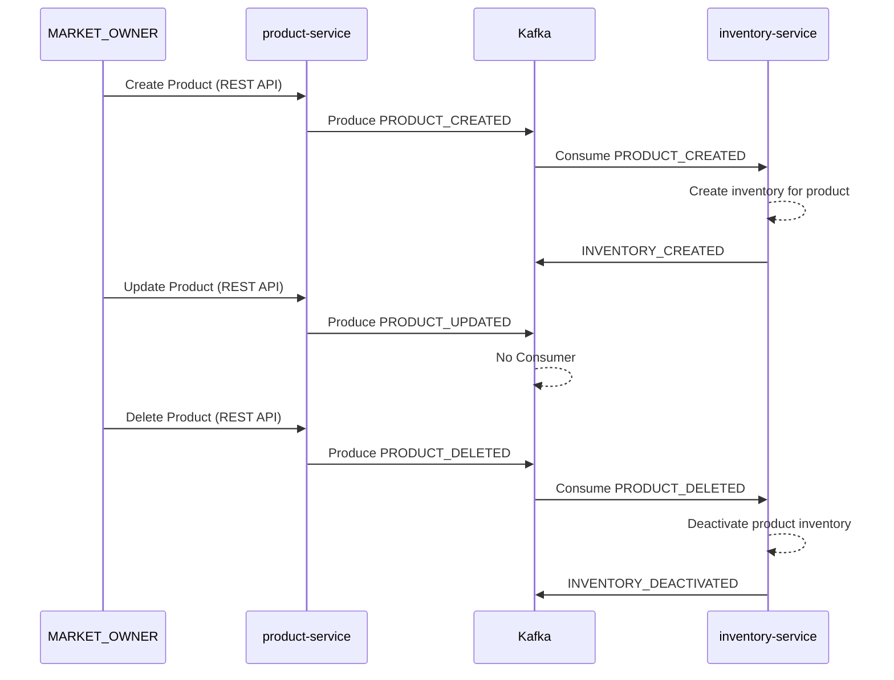
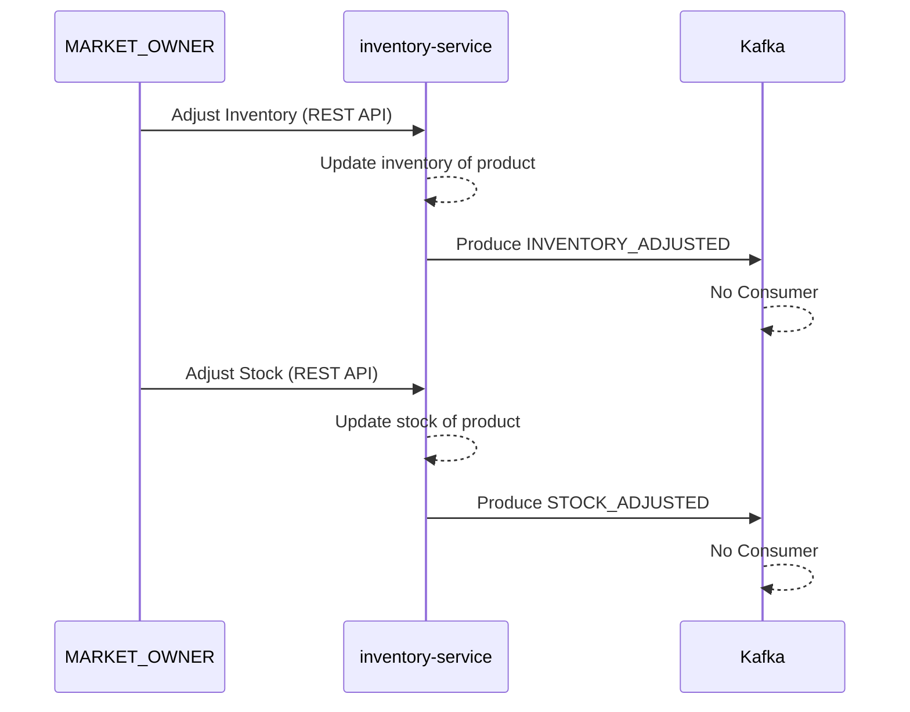
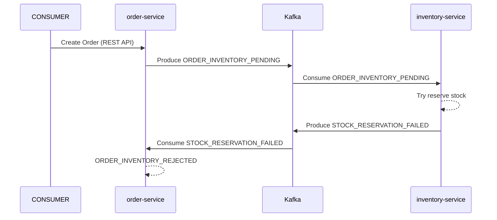
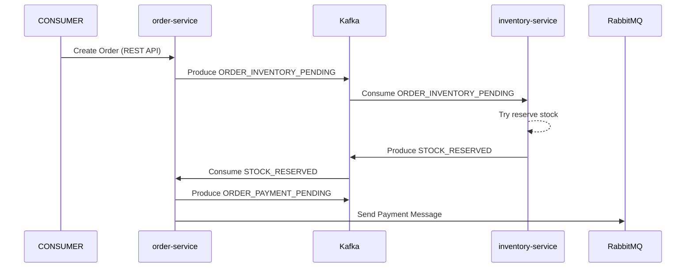
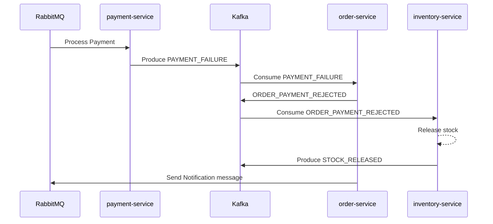
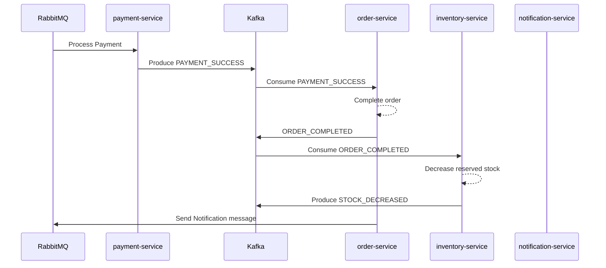
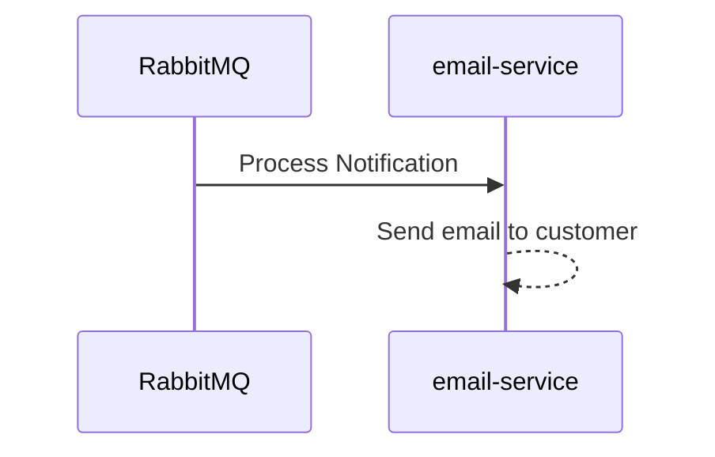

[← Return to home](../README.md)

# Flows

## Product Lifecycle

## Inventory & Stock Adjustments

## Order Creation – Inventory Reservation Failure

## Order Creation – Inventory Reservation Success

## Payment Failure Flow

## Payment Success & Order Completion

## Notification Flow

